# NASA Cosmos Messenger

[](https://github.com/samson0720/NASA-Cosmos-Messenger/actions/workflows/android-ci.yml)


一個以對話形式瀏覽 NASA Astronomy Picture of the Day（APOD）的 Android App，使用者可以輸入日期查詢 APOD、收藏喜歡的天文圖片、離線回看快取內容，並把 APOD 轉成看圖解說、生日星空卡或 3 張收藏圖片的回憶拼貼。

本專案使用 Kotlin、Jetpack Compose、Retrofit、Moshi、Room 與 Flask + Groq LLM gateway 實作，重點放在 Android-native 體驗、清楚資料分層、穩定錯誤處理、API key 安全邊界。

## App Preview


<table>
  <tr>
    <td align="center" width="50%">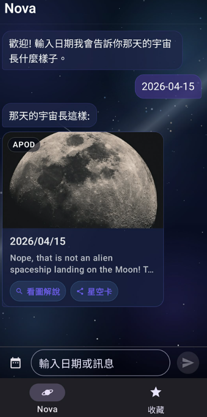</td>
    <td align="center" width="50%">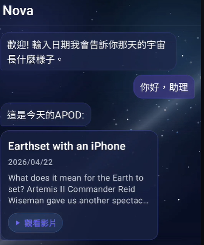</td>
  </tr>
  <tr>
    <td align="center"><b>Nova 日期查詢</b><br />輸入日期後以聊天卡片顯示 APOD。</td>
    <td align="center"><b>Video APOD</b><br />影片類型改以外部連結開啟。</td>
  </tr>
  <tr>
    <td align="center" width="50%">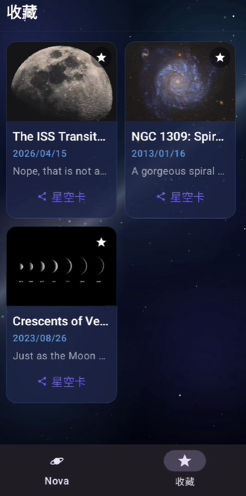</td>
    <td align="center" width="50%">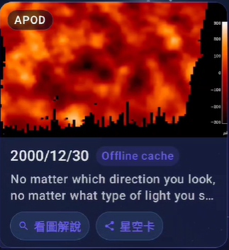</td>
  </tr>
  <tr>
    <td align="center"><b>本機收藏</b><br />收藏 APOD 並在 Favorites 頁管理。</td>
    <td align="center"><b>Offline cache</b><br />APOD 成功查詢後寫入 Room cache，離線時可回看先前結果。</td>
  </tr>
</table>

## Bonus Features

<table>
  <tr>
    <td align="center" width="50%">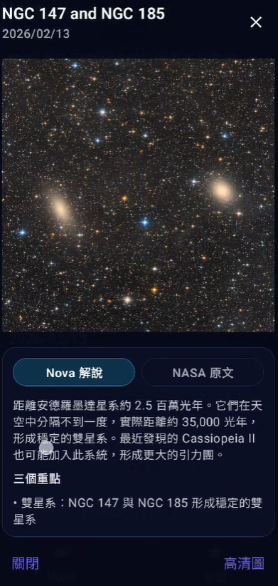</td>
    <td align="center" width="50%">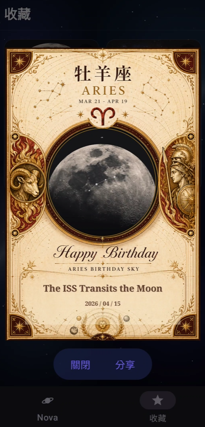</td>
  </tr>
  <tr>
    <td align="center"><b>看圖解說</b><br />把 NASA 原文轉成繁中白話說明，並保留原文切換。</td>
    <td align="center"><b>生日星空卡預覽</b><br />可從 Nova APOD 或 Favorites 收藏項目生成預覽。</td>
  </tr>
  <tr>
    <td align="center" width="50%">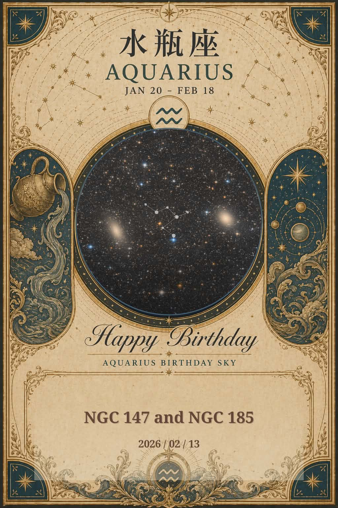</td>
    <td align="center" width="50%">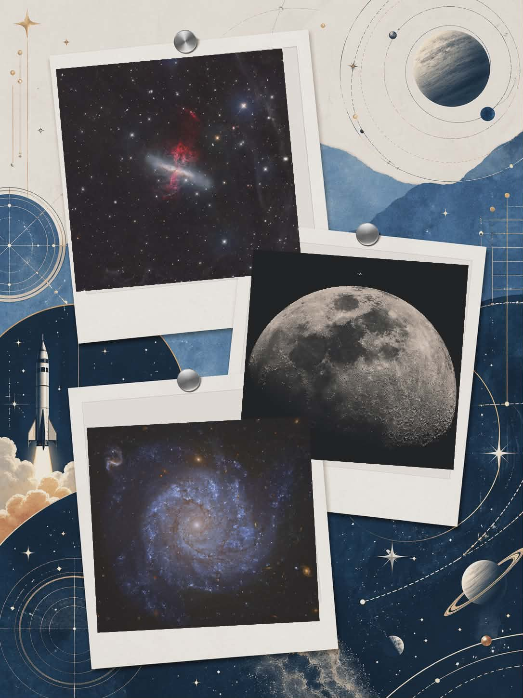</td>
  </tr>
  <tr>
    <td align="center"><b>星空卡成品</b><br />生成可透過 Android share sheet 分享的圖片。</td>
    <td align="center"><b>收藏拼貼</b><br />從收藏中選 3 張 image APOD 合成回憶拼貼。</td>
  </tr>
</table>

## Favorite Collage Templates

收藏拼貼提供三種可選模板，使用者從收藏中選滿 3 張 image APOD 後，可以選擇其中一種生成分享圖片。

<table>
  <tr>
    <td align="center">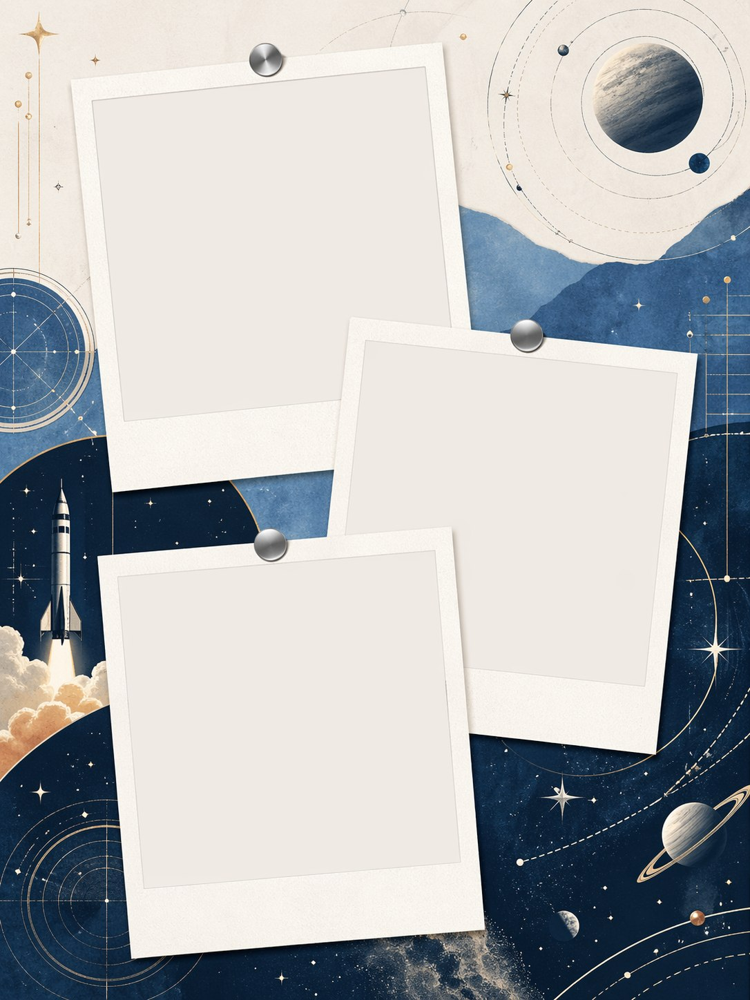</td>
    <td align="center">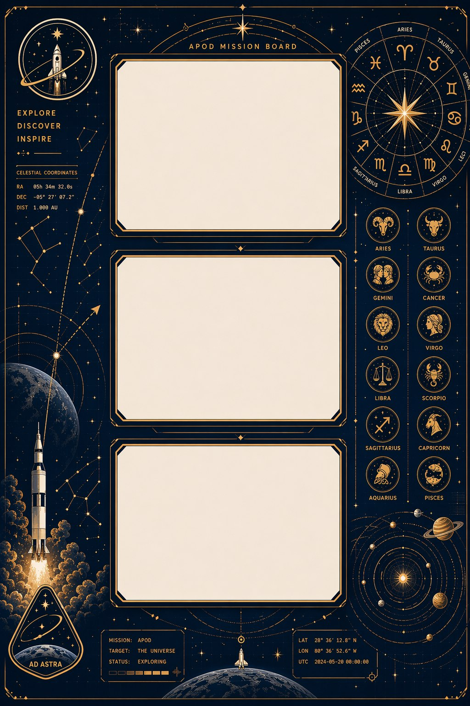</td>
    <td align="center">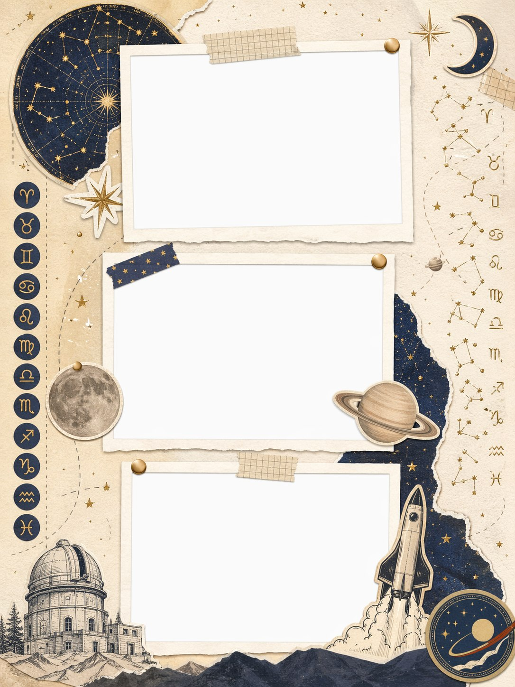</td>
  </tr>
  <tr>
    <td align="center">星軌拼貼</td>
    <td align="center">APOD 任務板</td>
    <td align="center">星象手帳</td>
  </tr>
</table>

## Birthday Star Card Templates

生日星空卡會依照使用者生日對應星座，套用對應模板生成分享圖片。

<table>
  <tr>
    <td align="center">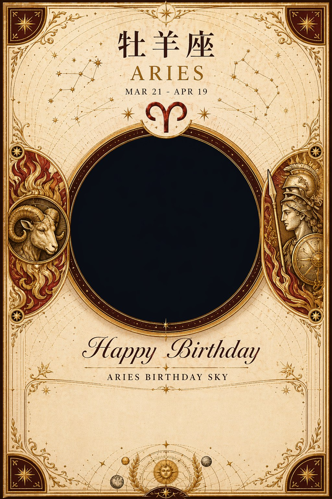</td>
    <td align="center">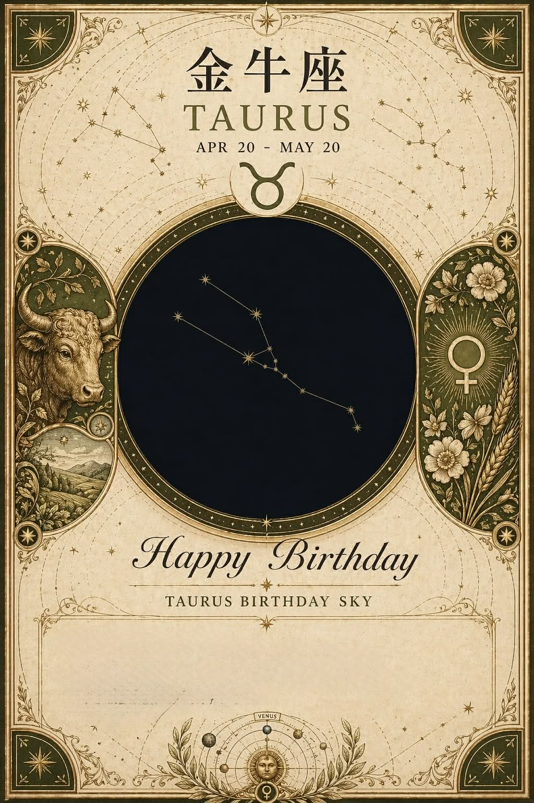</td>
    <td align="center"></td>
    <td align="center"></td>
  </tr>
  <tr>
    <td align="center">Aries</td>
    <td align="center">Taurus</td>
    <td align="center">Gemini</td>
    <td align="center">Cancer</td>
  </tr>
  <tr>
    <td align="center"></td>
    <td align="center"></td>
    <td align="center">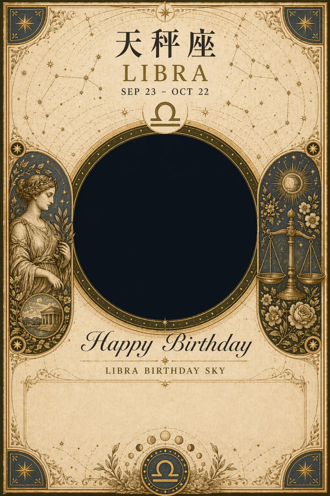</td>
    <td align="center"></td>
  </tr>
  <tr>
    <td align="center">Leo</td>
    <td align="center">Virgo</td>
    <td align="center">Libra</td>
    <td align="center">Scorpio</td>
  </tr>
  <tr>
    <td align="center">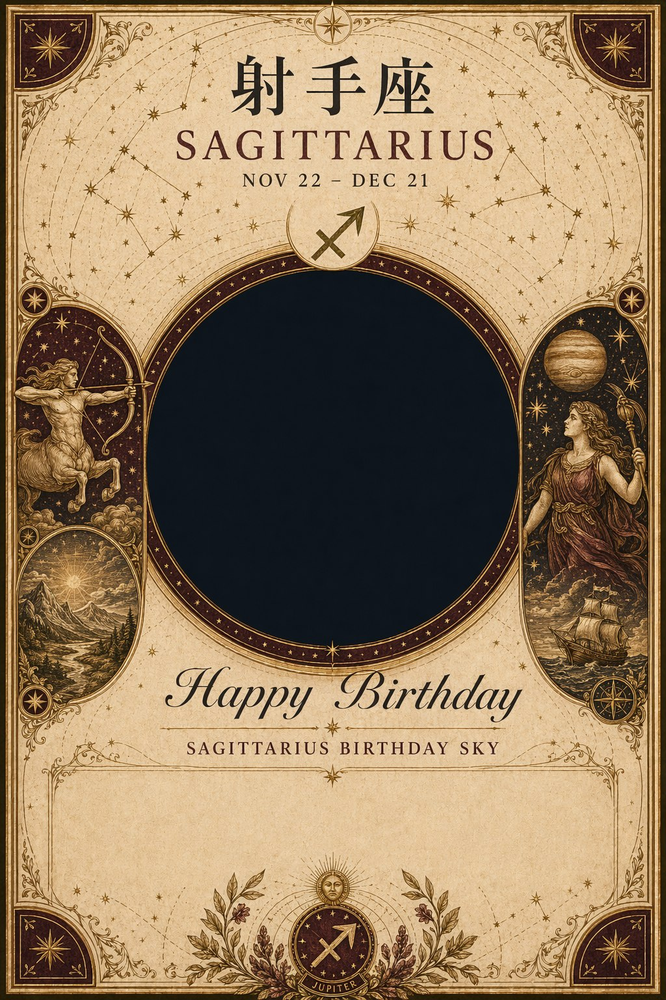</td>
    <td align="center">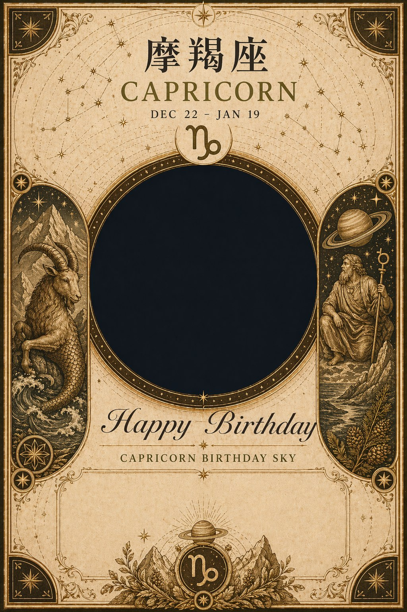</td>
    <td align="center">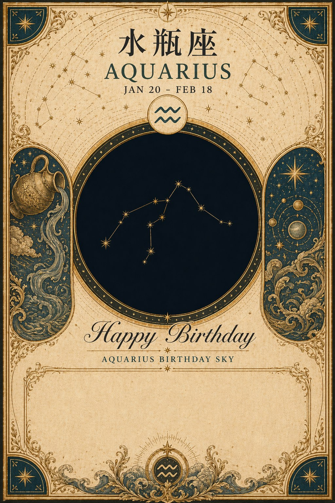</td>
    <td align="center">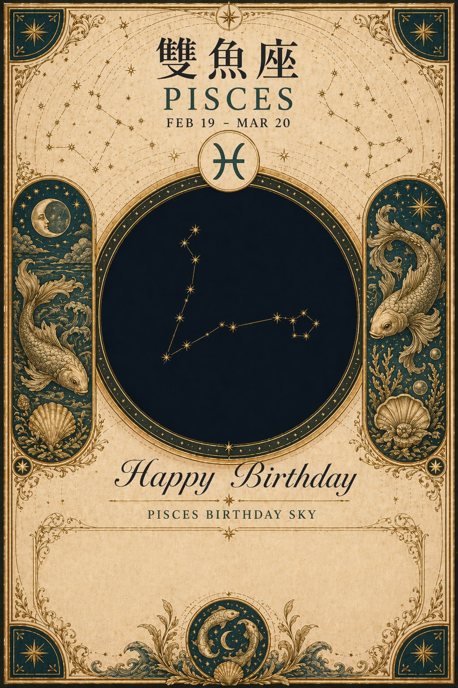</td>
  </tr>
  <tr>
    <td align="center">Sagittarius</td>
    <td align="center">Capricorn</td>
    <td align="center">Aquarius</td>
    <td align="center">Pisces</td>
  </tr>
</table>

## Feature Coverage

| 題目要求 / 加分項 | 說明 |
| --- | --- |
| 兩個主要分頁 | Nova 對話頁、Favorites 收藏頁 |
| Chat-style APOD | 使用者訊息靠右、Nova 回覆靠左，自動捲到底部 |
| 日期查詢 | 支援 `yyyy/MM/dd`、`yyyy-MM-dd`、`yyyy.M.d` 與句中日期 |
| NASA APOD API | Retrofit + Moshi，支援今日與指定日期查詢 |
| Image / Video handling | image 顯示卡片，video 顯示外部開啟按鈕 |
| Favorites | Room 本機保存、瀏覽、刪除、開啟來源 |
| Bonus: Offline cache | 成功查詢後寫入 Room / SQLite cache，網路失敗時依日期 fallback |
| Bonus: Nova Guide | 圖片 APOD 可產生繁中白話解說，並保留 NASA 原文 |
| Bonus: Birthday star card | 使用生日 APOD 與星座模板生成可分享圖片 |
| Bonus: Favorite collage | 從收藏選 3 張 image APOD，選模板，預覽並分享 |
| CI / APK artifact | GitHub Actions 跑 unit tests、build debug APK、upload artifact |
| Unit tests | 66 個 JVM unit tests，覆蓋核心規則與資料層 |

## External API Reliability

NASA APOD API 與 Nova Guide backend 都是外部服務，實際使用時可能遇到回應較慢、timeout、暫時連不上或 server error。App 針對這些狀況做了防護：

- APOD 查詢遇到 transient error 時會重試一次。
- 網路失敗時會依日期讀取 Room / SQLite offline cache。
- cache 命中時會清楚標記 `Offline cache`，避免使用者誤以為是最新網路結果。
- Nova Guide endpoint 未設定或暫時無法使用時，不會影響 APOD 查詢、收藏、星空卡與收藏拼貼功能。

## Tech Stack

| 技術 | 用途 |
| --- | --- |
| Kotlin / Coroutines | Android app 與非同步流程 |
| Jetpack Compose / Material 3 | UI |
| ViewModel / StateFlow | 狀態管理 |
| Retrofit / Moshi / OkHttp | NASA APOD API 與 Nova Guide backend |
| Room | Favorites 與 APOD cache |
| Coil | APOD image loading |
| JUnit / Robolectric / AndroidX Test Core | JVM unit tests |
| GitHub Actions | CI、unit tests、debug APK artifact |

## Run Locally

### API Keys

Android app 會從 `local.properties` 讀取 NASA API key 與選填的 Nova Guide endpoint：

```properties
NASA_API_KEY=your_key_here
NOVA_GUIDE_ENDPOINT=http://10.0.2.2:5050/v1/apod-guide
```

如果沒有設定 `NASA_API_KEY`，App 會 fallback 到 NASA `DEMO_KEY`，讓 fresh clone 後仍可 build/run。`NOVA_GUIDE_ENDPOINT` 是選填；未設定時 APOD 查詢、Favorites、生日星空卡與收藏拼貼仍可正常使用。

### Build And Test

```powershell
.\gradlew.bat :app:testDebugUnitTest
.\gradlew.bat :app:assembleDebug
```

Debug APK output:

```text
app/build/outputs/apk/debug/app-debug.apk
```

## Project Links

- [Notion Kanban](https://www.notion.so/347315bb151b8088a834e39b7f4ca209?v=347315bb151b8014b4db000c452f293f)
- [Demo video](https://youtu.be/OB3Bx7gs-iE?si=Tt5XeXULb63X-uPm)
