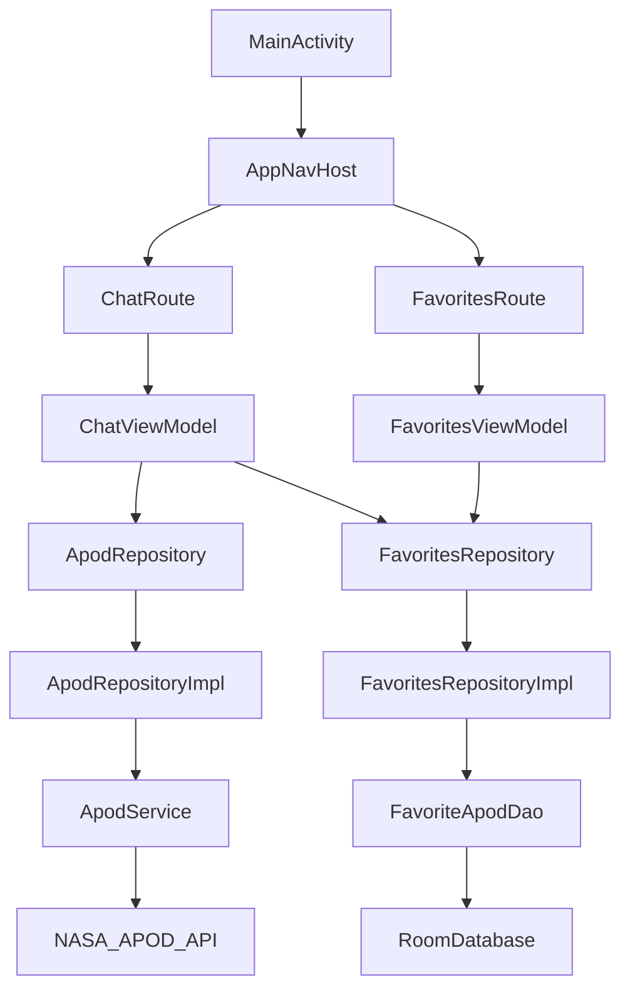

# NASA Cosmos Messenger

一個以對話形式瀏覽 NASA Astronomy Picture of the Day（APOD）的 Android App。使用者可以在 Nova 對話頁輸入一般訊息或指定日期，取得對應的每日天文圖片；喜歡的 APOD 卡片可長按收藏，並在收藏頁瀏覽與刪除。

本專案使用 Kotlin、Jetpack Compose、Retrofit、Moshi 與 Room 實作，重點放在清楚的資料分層、穩定的日期解析、可恢復的錯誤處理，以及本機收藏保存。

## 專案展示

截圖可在提交前放入 `docs/screenshots/`。目前先預留以下位置：

| Nova 對話頁 | 收藏頁 |
| --- | --- |
| `docs/screenshots/nova-chat.png` | `docs/screenshots/favorites-grid.png` |
| 日期輸入、Nova 回覆、APOD 卡片、鍵盤互動 | 本機收藏、圖片網格、刪除操作 |

| 影片 / 錯誤狀態 | 測試結果 |
| --- | --- |
| `docs/screenshots/video-apod.png` | `docs/screenshots/unit-tests.png` |
| video 類型 APOD 的外部連結處理 | `:app:testDebugUnitTest` 執行結果 |

開發流程看板：

- Notion Kanban：https://www.notion.so/347315bb151b8088a834e39b7f4ca209?v=347315bb151b8014b4db000c452f293f

## 功能一覽

| 功能 | 說明 | 狀態 |
| --- | --- | --- |
| 兩個主要分頁 | Nova 對話頁、收藏頁 | 完成 |
| APOD 查詢 | 串接 NASA APOD API，支援今日與指定日期 | 完成 |
| 日期辨識 | 從使用者訊息中擷取支援格式的日期 | 完成 |
| 對話介面 | 使用者訊息靠右、Nova 回覆靠左，新訊息自動捲到底部 | 完成 |
| 圖片 APOD 卡片 | 顯示圖片、標題、日期與說明摘要 | 完成 |
| 影片 APOD 處理 | 以外部連結開啟影片來源 | 完成 |
| 長按收藏 | 長按 Nova 的 APOD 卡片加入收藏 | 完成 |
| 本機收藏 | 使用 Room 保存收藏資料 | 完成 |
| 收藏管理 | 收藏頁可瀏覽、開啟來源、刪除收藏 | 完成 |
| 單元測試 | 日期解析、資料轉換、Repository 錯誤與重試行為 | 完成 |

## 技術架構

專案採用 feature-based 結構，並保留 data / domain / UI 邊界。對這個 assessment 規模而言，使用手動依賴組裝即可維持簡潔；Repository 仍透過 constructor 注入，方便測試替換。



目錄重點：

```text
data/local      Room database、DAO、Entity
data/remote     Retrofit service、DTO、Network module
data/mapper     DTO / Entity 與 Domain model 轉換
data/repository FavoritesRepository 實作
domain/model    App 內部穩定資料模型
domain/repository Repository contract
feature/chat    Nova 對話 UI 與狀態管理
feature/favorites 收藏 UI 與狀態管理
navigation      Bottom navigation 與 tab destination
ui              共用 UI 元件與 theme
util            日期解析與格式化
```

### 架構選擇

- **Feature-based UI**：聊天與收藏各自集中畫面與狀態管理，方便閱讀功能流程。
- **Domain model 分離**：API DTO 與 Room Entity 不直接進入 UI，降低資料來源變動的影響。
- **手動依賴組裝**：避免為小型作業引入額外框架，同時保留 constructor injection 的可測性。
- **集中日期規則**：所有 APOD 日期解析、格式化與範圍檢查都在 `ApodDateParser`。
- **Room 以日期作為主鍵**：APOD 每天只有一筆，日期是自然識別；重複收藏可直接透過 `OnConflictStrategy.IGNORE` 處理。
- **網路錯誤分類**：Repository 將 HTTP / IO 例外轉成 app 可理解的錯誤狀態。

## 日期格式

Nova 會從訊息中尋找日期。日期可以是完整訊息，也可以夾在句子裡。

| 格式 | 範例 | 說明 |
| --- | --- | --- |
| `yyyy/MM/dd` | `1995/06/20` | 題目要求格式 |
| `yyyy-MM-dd` | `1995-06-20` | 題目要求格式 |
| `yyyy.M.d` | `1995.6.20` | 額外支援 |

驗證規則：

- APOD 起始日為 `1995/06/16`。
- 早於起始日會顯示日期過早提示。
- 未來日期會顯示未來日期提示。
- 類似日期但格式不支援，例如 `2024年01月01日` 或 `2024-01/01`，會顯示格式提示。
- 訊息中沒有日期時，預設查詢今日 APOD。

## 資料保存

收藏資料使用 Room 儲存在本機：

- table：`favorite_apod`
- primary key：`date`
- 排序：`savedAt DESC`
- 重複收藏：由 `OnConflictStrategy.IGNORE` 判斷並回傳已收藏狀態
- 觀察方式：收藏頁透過 `Flow` 接收資料變化

## 錯誤處理

| 情境 | App 行為 |
| --- | --- |
| HTTP 429 | 顯示 NASA 請求量過大提示 |
| HTTP 404 | 顯示該日期沒有 APOD |
| 網路錯誤 | 顯示連線失敗提示 |
| timeout / 502 / 503 / 504 | 重試一次 |
| DNS / 離線 | 不重試，直接顯示網路錯誤 |
| coroutine cancellation | 保留取消語意，不轉成一般錯誤 |

## 視覺與互動優化

- 星空背景套用於主要頁面。
- Nova 與收藏頁共用簡潔 top bar。
- 深色半透明聊天泡泡與 APOD 卡片，提升星空背景上的可讀性。
- 自訂 Saturn icon 作為 Nova tab 圖示。
- 收藏頁使用兩欄卡片網格，方便快速瀏覽。
- 修正鍵盤開啟時輸入框與 soft keyboard 之間的間距問題。

## 測試

目前包含 JVM unit tests，覆蓋核心規則與 data layer。

| 測試檔案 | 覆蓋內容 |
| --- | --- |
| `ApodDateParserTest` | 日期格式、非法日期、起始日、未來日期、顯示格式 |
| `ApodMapperTest` | APOD DTO 轉 Domain model |
| `FavoriteApodMapperTest` | 收藏 Entity / Domain model 轉換 |
| `ApodRepositoryImplTest` | API date query、HTTP error mapping、IO error、retry 行為 |

目前結果：

```text
:app:testDebugUnitTest
28 tests, 0 failures
```

執行測試：

```powershell
.\gradlew.bat :app:testDebugUnitTest
```

## API Key

App 會從 `local.properties` 讀取 NASA API key：

```properties
NASA_API_KEY=your_key_here
```

若沒有設定，會使用 NASA 的 `DEMO_KEY`，可讓專案在 fresh checkout 後仍能 build，但請求限制較嚴格。

## 建置方式

環境需求：

- JDK 17
- Android SDK 34
- Android Gradle Plugin 8.5.2

Debug build：

```powershell
.\gradlew.bat :app:assembleDebug
```

APK 位置：

```text
app/build/outputs/apk/debug/app-debug.apk
```

## 已完成加分與延伸

- 星系風格 UI 與自訂背景。
- 影片 APOD 外部連結處理。
- Repository transient error retry。
- 核心資料層 unit tests。
- Notion Kanban 開發流程看板預留。

## 後續可改進

- 補上 ViewModel tests，驗證完整對話與收藏流程。
- 補上 Room in-memory DAO tests。
- 增加離線 APOD cache，和使用者主動收藏分開保存。
- 增加分享用星空卡片圖片。
- 補上正式截圖與操作錄影連結。
